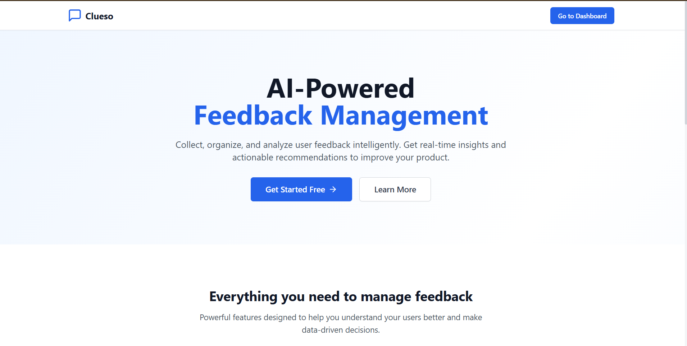

# Clueso-Feedback-Platform

<p align="center">
  
</p>

🔗 **Live Demo**
- Frontend: https://clueso-feedback-frontend.onrender.com
- Backend API: https://clueso-feedback-backend.onrender.com

## What This Project Does

A full-stack feedback collection and sentiment analysis platform inspired by Clueso.io's philosophy of actionable insights. Unlike Clueso's video content generation, this application focuses on collecting user feedback, analyzing sentiment, and providing real-time dashboard updates to help organizations understand their users better.

## Core Features

### ✅ **Authentication System**
- JWT-based user authentication
- Secure signup/login with password hashing (bcrypt)
- Protected routes and session management

### ✅ **Feedback Collection**
- User-friendly feedback submission forms
- Categorization (Bug, Feature Request, General, Improvement, Complaint)
- Priority levels and status tracking

### ✅ **Real-time Dashboard**
- Live updates using Socket.IO
- Near real-time synchronization across multiple clients using Socket.IO
- Real-time statistics and counters

### ✅ **AI-Powered Sentiment Analysis**
- Mock AI service for consistent demo experience
- Sentiment classification (Positive, Negative, Neutral)
- Keyword extraction and suggested actions
- Architecture supports real OpenAI integration

In this submission, the mock AI service is enabled by default to ensure consistent local execution. The architecture supports seamless replacement with a real OpenAI provider.

## Technical Architecture

```
Frontend (Next.js) ➜ Backend (Express.js) ➜ MongoDB ➜ Socket.IO ➜ AI Service

User submits feedback → Backend processes → Saves to DB → AI analyzes sentiment → 
Socket.IO broadcasts → Dashboard updates in real-time
```

### Data Flow:
1. **User Authentication**: JWT tokens stored in localStorage
2. **Feedback Submission**: Form data validated and stored in MongoDB
3. **AI Processing**: Sentiment analysis runs on feedback text
4. **Real-time Updates**: Socket.IO emits events to connected clients
5. **Dashboard Refresh**: UI updates without page reload

## Key Differences from Clueso.io

| Feature | Clueso.io | This Project |
|---------|-----------|--------------|
| **Primary Focus** | Video content generation | Feedback sentiment analysis |
| **AI Usage** | Content creation | Sentiment classification |
| **Real-time** | Not emphasized | Core feature with Socket.IO |
| **Target Users** | Content creators | Product teams & organizations |

## Technical Decisions & Rationale

### **Why Next.js?**
- Server-side rendering for better SEO
- Built-in API routes (though we use separate backend)
- Excellent developer experience with hot reload

### **Why MongoDB?**
- Flexible schema for feedback data
- Easy to scale horizontally
- JSON-like documents match JavaScript objects

### **Why Socket.IO?**
- Reliable real-time communication
- Automatic fallback to polling
- Room-based updates for targeted notifications

### **Why Mock AI Service?**
- Consistent demo experience without API costs
- Easy to test and develop locally
- Architecture ready for real OpenAI integration

## Implementation Assumptions

### **What's Included:**
- ✅ Complete authentication system
- ✅ CRUD operations for feedback
- ✅ Real-time dashboard updates
- ✅ Sentiment analysis (mocked)
- ✅ Responsive UI design

### **What's Not Implemented:**
- ❌ Email notifications (would require email service)
- ❌ File attachments (focused on text feedback)
- ❌ Advanced analytics (basic stats only)
- ❌ Multi-language support (English only)

### **Production Considerations:**
- Environment variables for all secrets
- Error handling with try/catch blocks
- Input validation using express-validator
- Rate limiting for API protection

## Error Handling & Edge Cases

### **Backend Error Handling:**
- All routes wrapped in try/catch blocks
- Consistent error response format
- JWT token validation and expiration
- MongoDB connection error handling

### **Frontend Error Handling:**
- Loading states for all async operations
- Toast notifications for user feedback
- Network error handling with retry logic
- Form validation with user-friendly messages

## Local Setup

```bash
git clone https://github.com/nitishchy12/clueso-feedback-platform.git
cd clueso-feedback-platform
npm install
npm run dev

# Frontend: http://localhost:3000
# Backend: http://localhost:5000
```

## ⏳ Free Tier Hosting Notice

This backend is deployed on Render's free tier.  
Due to platform limitations, the service may spin down after inactivity.

As a result:
- The **first request** after inactivity may take **30–50 seconds**
- Subsequent requests respond normally

This is a hosting constraint, not an application issue.

## Deployment

The application is deployed on Render and accessible publicly.

## Testing

Testing hooks are scaffolded. Automated tests can be added using Jest and React Testing Library.

## Author

Nitish Kumar Choudhary (Assignment submission – original implementation)